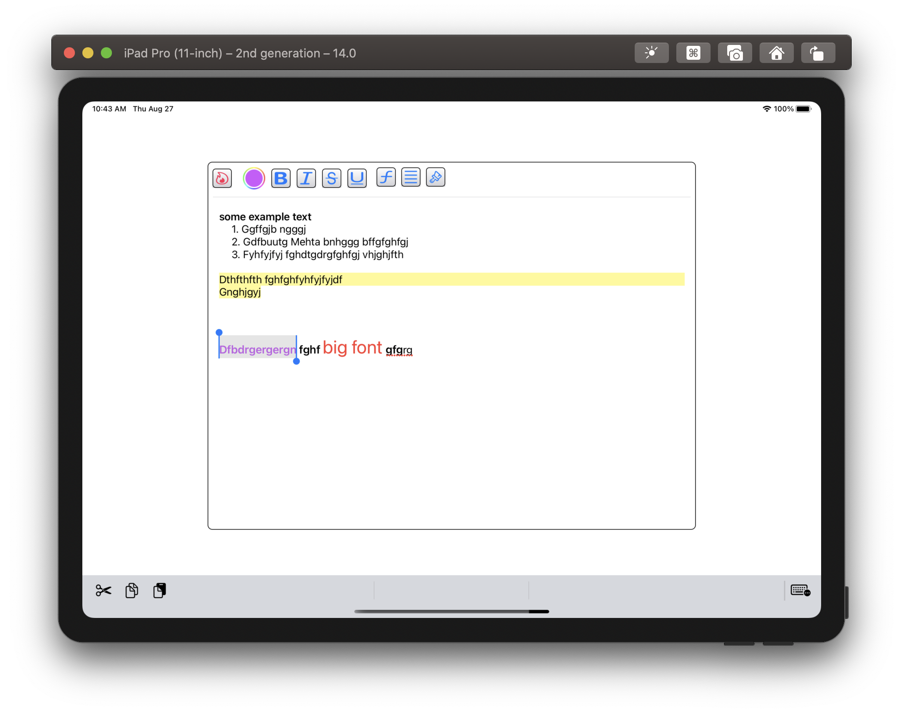

# SwiftUI text editor based on LEOTextView

  

## LeoTextEditor

**LeoTextEditor** is a text editor entirely based on the great work of [LEOTextView](https://github.com/tuesleep/LEOTextView). It is work in progress...

The idea is to have a text editor with **attributed text** that can be used easily in SwiftUI. So I started modifying [LEOTextView](https://github.com/tuesleep/LEOTextView) to see if it can be done. 

The changes include, wrapping LEOTextView for use in SwiftUI, and a new toolbar. 
There are in fact, two toolbars to choose from. A default simple toolbar and a more advanced one. 

## Usage

The main element is **LeoTextEditor** as shown in the example below. 
It takes a string binding, the size of the editor frame, and the toolbar type. See *ContentView* for an example use.

The *text* passed into the **LeoTextEditor** consists of a json string that describes the text and all its attributes. Such as:

    let w = UIScreen.main.bounds.width * CGFloat(0.9)
    let h = UIScreen.main.bounds.height * CGFloat(0.5)
    
    @State var text = ""
    
    var body: some View {
        LeoTextEditor(text: $text, width: w, height: h)
    }

After some typing and editing, *text* will look like this:

    {
      "text" : "Some text in red ",
      "attributes" : [
        {
          "length" : 7,
          "name" : "NSFont",
          "fontType" : "normal",
          "location" : 10
        },
        {
          "name" : "NSColor",
          "location" : 10,
          "foregroundColor" : "#ff3a2f",
          "length" : 7
        },
        {
          "location" : 0,
          "name" : "NSFont",
          "length" : 10,
          "fontType" : "normal"
        },
        {
          "foregroundColor" : "#000000",
          "location" : 0,
          "length" : 10,
          "name" : "NSColor"
        }
      ]
    }
    
You can easily get just the text part of the json string using:

    let justTheText = LEOTextView.getTextFromJsonString(text)
    
To use the more advanced toolbar, use:

    LeoTextEditor(text: $text, width: w, height: h, simple: false)
    
    
    
### Requirement

Targeting ios 14 and macos 11 (untested)

### References

-  [LEOTextView](https://github.com/tuesleep/LEOTextView)

### Installation

Currently all you need is in the **Sources** directory.

Eventually installation will be through Swift Package Manager (SPM).

### License

As with **LEOTextView** available under the MIT license. See the LICENSE file for more info.

